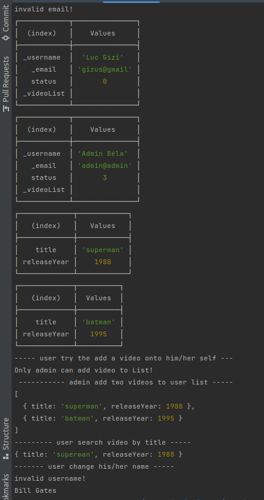

### Olvasd el figyelmesen a file-okban található leírásokat, majd készíts el a ts-videostore mappában lévő entitásokat!

**Haladj ezzel a sorrenddel:**

- video.interface.ts
- status.enum.ts
- user.ts
- customer.ts

#### Pár tipp:
- Mialatt fejlesztesz lép be a ```02_ts``` mappába, és inditsd el a **ts compilert**: ```tsc --watch```
- Amikor futtatni akarod a lefordított fájlokat, egy másik terminálon lépj be a ```02-ts/dist/ts-videostore``` mappába és ott futtasd a ```node  videostore.js``` parancsot.
- Figyelj arra hogy amikor egy **ts**-file-ba **import** parancsot használsz, a behúzott file neve **.js**-re végzödjön!!


Figyelj arra, hogy minél inkább típusosak legyenek a változóid, értékeid!  
Ha kész van a fájlokkal teszteld megoldásod a videostore.ts-ben található utasításoknak megfelelően

